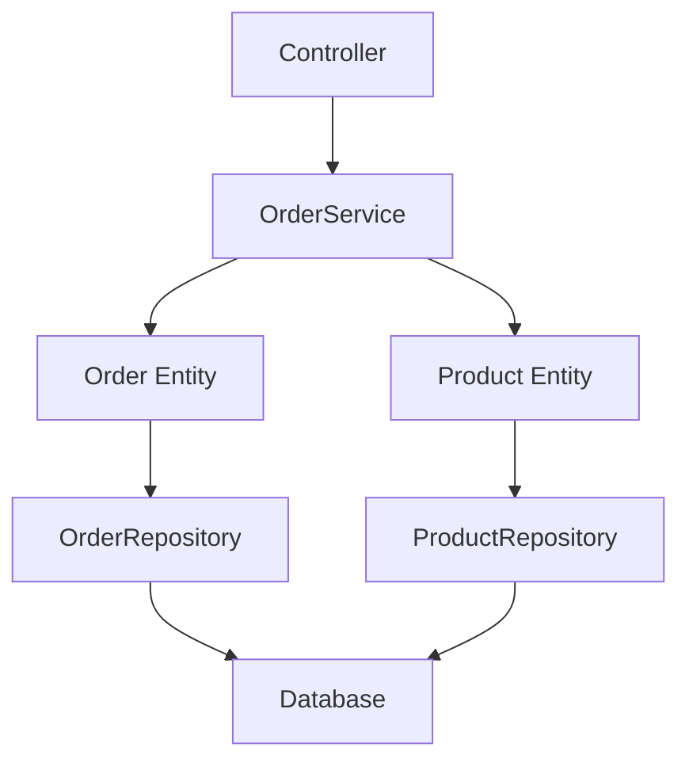

# Layered Architecture

## 概述
分層架構是一種將系統 **分層** 設計的軟體架構模式，每一層只專注處理自己的職責，並且只能與相鄰的層級溝通

## 核心原則
- **單一職責原則**：每一層只負責特定的功能
- **依賴倒置**：上層依賴下層的抽象，而非具體實作
- **關注點分離**：業務邏輯與技術實作分離

## 常見的分層方式

| 層級 | 名稱 | 職責 | Laravel 實作 | 舉例 |
|------|------|------|--------------|------|
| 1 | **Presentation Layer<br>（表示層）** | • 接收使用者輸入<br>• 處理 HTTP 請求<br>• 回傳適當回應 | Controllers、API Resources | `OrderController`、`AuthController` |
| 2 | **Application Layer<br>（應用層）** | • 協調業務流程<br>• 調用 Domain 服務<br>• 處理交易邊界 | Services、Actions、Use Cases | `OrderService`、`PaymentService` |
| 3 | **Domain Layer<br>（領域層）** | • 核心業務邏輯<br>• 業務規則驗證<br>• 領域知識封裝 | Entities、Value Objects、Domain Services | `Order`、`Product`、`OrderDomainService` |
| 4 | **Infrastructure Layer<br>（基礎設施層）** | • 外部系統整合<br>• 資料持久化<br>• 第三方服務 | Repositories、External APIs、Mail Services | `OrderRepository`、`PaymentGateway` |

## 層級溝通方向

### 依賴規則
每一層只能依賴下一層，形成單向依賴鏈：

```
Presentation Layer
       ↓
Application Layer  
       ↓
Domain Layer
       ↓
Infrastructure Layer
```

### 具體流向
```
Controller → Service → Domain → Repository → Database
```

### 架構優勢
- **技術無關性**：上層不需要知道下層的具體實作技術
- **可測試性**：Domain 層可以獨立進行單元測試
- **可維護性**：更換基礎設施（如資料庫）時影響範圍最小
- **可擴展性**：新增功能時可以遵循既有架構模式

## 實際範例：訂單建立流程

### 流程說明
以「訂單建立」功能為例，展示各層級的職責分工：



### 各層級職責

#### 1. Presentation Layer（Controller）
```php
// OrderController.php
public function store(CreateOrderRequest $request)
{
    $orderData = $request->validated();
    $order = $this->orderService->createOrder($orderData);
    return new OrderResource($order);
}
```

#### 2. Application Layer（Service）
```php
// OrderService.php
class OrderService
{
    public function __construct(
        private OrderRepositoryInterface $orderRepository
    ) {}

    /**
     * 建立新訂單
     *
     * @param array $orderData 訂單資料
     * @return Order 建立的訂單領域物件
     * @throws InvalidOrderException 當訂單資料無效時
     * @throws DatabaseException 當資料庫操作失敗時
     */
    public function createOrder(array $orderData): Order
    {
        return DB::transaction(function() use ($orderData) {
            // 檢查業務流程
            $this->validateOrderCreation($orderData);
            
            // 呼叫 Domain 物件建立訂單
            $order = Order::create($orderData);
            
            // 透過 Repository 保存到資料庫
            return $this->orderRepository->save($order);
        });
    }

    /**
     * 驗證訂單建立的前置條件
     */
    private function validateOrderCreation(array $orderData): void
    {
        // 實作業務邏輯驗證
        // 1. 檢查使用者是否有權限建立訂單
        if (!$this->userService->canCreateOrder($orderData['user_id'])) {
            throw new UnauthorizedOrderCreationException();
        }
        
        // 2. 檢查庫存是否足夠（需要查詢 ProductRepository）
        if (!$this->productService->hasEnoughStock($orderData['product_id'], $orderData['quantity'])) {
            throw new InsufficientStockException();
        }
        
        // 3. 檢查業務規則（如：單日訂單限制）
        if ($this->orderRepository->getTodayOrderCount($orderData['user_id']) >= 10) {
            throw new DailyOrderLimitExceededException();
        }
    }
}
```

#### 3. Domain Layer（Entity）
```php
// Order.php
class Order
{
    public static function create(array $data): self
    {
        // 1. 基本資料驗證
        if ($data['amount'] <= 0) {
            throw new InvalidOrderAmountException();
        }
        
        // 2. 領域規則驗證
        if ($data['quantity'] <= 0) {
            throw new InvalidQuantityException();
        }
        
        // 3. 業務規則驗證（純邏輯，不依賴外部）
        if ($data['amount'] !== $data['unit_price'] * $data['quantity']) {
            throw new AmountCalculationMismatchException();
        }
        
        return new self($data);
    }
}
```

#### 4. Infrastructure Layer（Repository）

##### Repository Interface（Domain Layer）
```php
// OrderRepositoryInterface.php
interface OrderRepositoryInterface
{
    /**
     * 保存訂單
     *
     * @param Order $order 訂單領域物件
     * @return Order 保存後的訂單
     */
    public function save(Order $order): Order;

    /**
     * 根據 ID 查找訂單
     *
     * @param int $id 訂單 ID
     * @return Order|null 訂單領域物件或 null
     */
    public function findById(int $id): ?Order;
}
```

##### Repository Implementation（Infrastructure Layer）
```php
// OrderRepository.php
class OrderRepository implements OrderRepositoryInterface
{
    public function __construct(
        private OrderModel $orderModel
    ) {}

    /**
     * 保存訂單到資料庫
     *
     * @param Order $order 領域物件
     * @return Order 保存後的領域物件
     * @throws DatabaseException 當資料庫操作失敗時
     */
    public function save(Order $order): Order
    {
        try {
            $orderModel = new $this->orderModel($order->toArray());
            $orderModel->save();
            
            // 更新領域物件的 ID
            $order->setId($orderModel->id);
            
            return $order;
        } catch (\Exception $e) {
            throw new DatabaseException('Failed to save order: ' . $e->getMessage());
        }
    }

    /**
     * 根據 ID 查找訂單
     *
     * @param int $id 訂單 ID
     * @return Order|null 訂單領域物件或 null
     */
    public function findById(int $id): ?Order
    {
        $orderModel = $this->orderModel->find($id);
        
        if (!$orderModel) {
            return null;
        }
        
        return Order::fromArray($orderModel->toArray());
    }
}
```

### 完整流程說明
1. **Controller** → 接收請求，呼叫 Service
2. **Service** → 協調業務流程，呼叫 Domain 和 Repository
3. **Domain** → 處理業務邏輯和規則驗證
4. **Repository** → 負責資料持久化

### 關鍵優點
- **職責分離**：每一層只處理自己的邏輯
- **易於測試**：可以針對每一層獨立測試
- **技術彈性**：更換資料庫或框架時影響最小
- **依賴倒置**：Service 依賴抽象介面，而非具體實作
