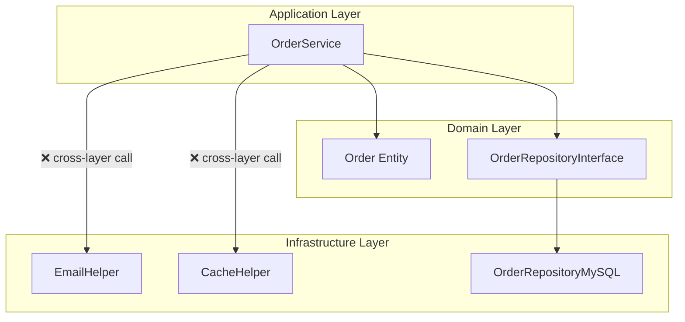
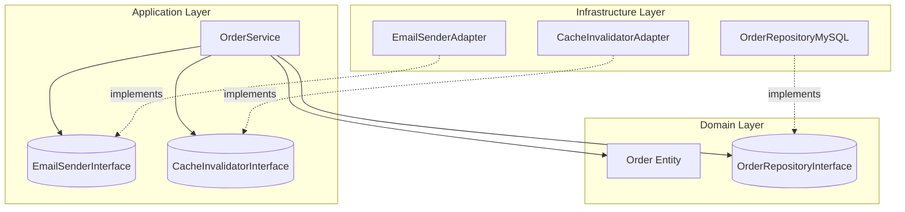
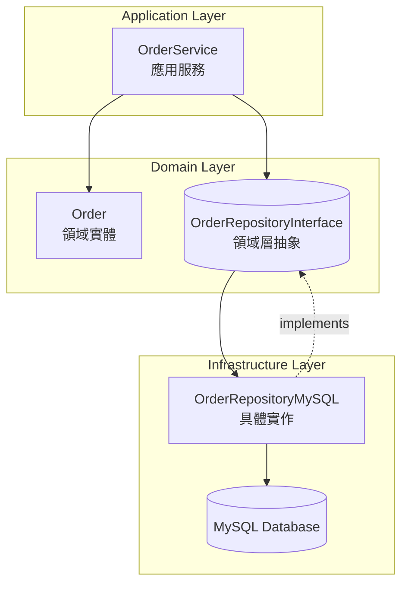
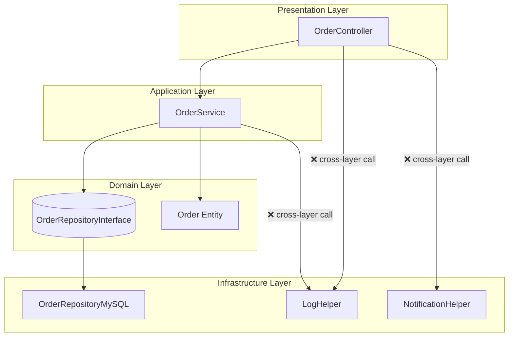
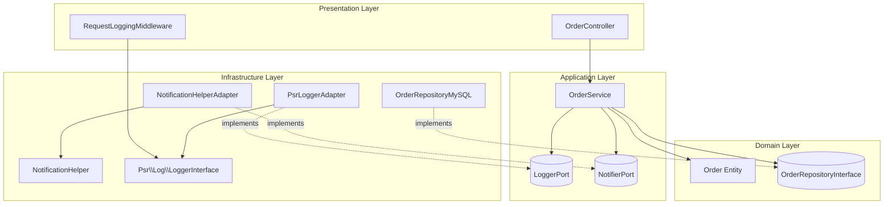
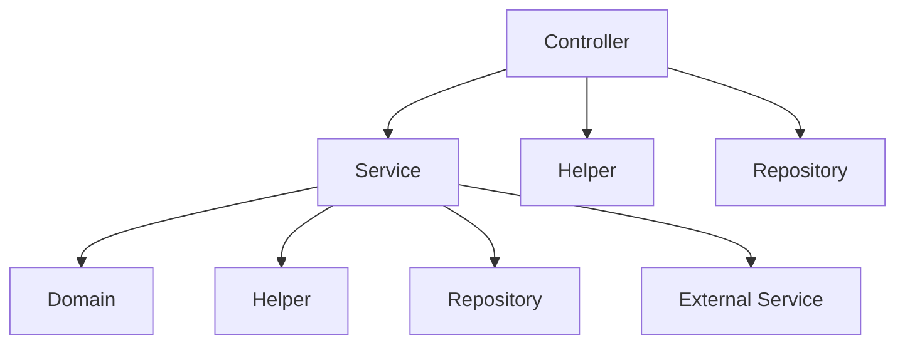

# What Happens When a Layer Violation Occurs?

## 概述
當違反分層架構的依賴規則，出現跨層呼叫時，會導致嚴重的架構問題。以下是常見的跨層呼叫情境及其後果：

- **依賴關係混亂**：層級職責模糊不清
- **測試困難**：無法獨立測試各層級
- **維護成本高**：修改一處影響多處
- **技術耦合**：上層直接依賴下層實作細節，使得架構難以替換或擴充

## 情境

### 情境一：Service 同時使用 Helper / Repository

**錯誤範例：**
```php
// OrderService.php - 違反分層架構
class OrderService
{
    public function __construct(
        private OrderRepositoryInterface $orderRepository,
        private EmailHelper $emailHelper, // ❌ 跨層依賴 Infrastructure
        private CacheHelper $cacheHelper  // ❌ 跨層依賴 Infrastructure
    ) {}

    public function createOrder(array $orderData): Order
    {
        // 業務邏輯
        $order = Order::create($orderData);
        $savedOrder = $this->orderRepository->save($order);
        
        // ❌ Service 直接使用 Infrastructure 層的 Helper
        $this->emailHelper->sendOrderConfirmation($savedOrder);
        $this->cacheHelper->invalidateUserCache($orderData['user_id']);
        
        return $savedOrder;
    }
}
```

**依賴關係：**


**問題分析：**
- Service 應該只依賴 `Domain 邏輯` 與 `抽象介面`，卻直接使用 Infrastructure 元件
- 破壞了 `上層只能依賴下層` 的規則
- 造成 Service 層與具體技術緊密耦合，導致測試與維護都變得困難

---

**正確做法：**

讓 Service 僅依賴 `EmailSenderInterface`、`CacheInvalidatorInterface` 等抽象，由外層注入實作

```php
// Application/Service/OrderService.php
final class OrderService
{
    public function __construct(
        private OrderRepositoryInterface $orderRepository,
        private EmailSenderInterface $emailSender,
        private CacheInvalidatorInterface $cacheInvalidator
    ) {}

    public function createOrder(array $data): Order
    {
        // Domain Layer
        $order = new Order(
            id: (int)$data['id'],
            userEmail: $data['email']
        );
        
        $saved = $this->orderRepository->save($order);

        // 只呼叫抽象介面（出站 Port）
        $this->emailSender->sendOrderConfirmation($saved);
        $this->cacheInvalidator->invalidateUserCache((int)$data['user_id']);

        return $saved;
    }
}
```

**依賴關係：**


你一定會想問：**為什麼 OrderRepositoryInterface 不是放在 Application？**

因為 Application 層只是協調用例 `Use Case`，例如「建立訂單」、「付款」、「取消訂單」<br>
而 `Repository` 屬於「如何在多個用例之間重建和保存 Domain 物件」<br>
這是 Domain 的 [**持久化關注**](#persistence-concern)，屬於模型邏輯的一環



### 情境二：Controller 和 Service 同時使用 Helper / Repository

**錯誤範例：**
```php
// OrderController.php - 違反分層架構
class OrderController extends Controller
{
    public function __construct(
        private OrderService $orderService,
        private LogHelper $logHelper, // ❌ Controller 直接使用 Helper
        private NotificationHelper $notifyHelper  // ❌ 跨層依賴
    ) {}

    public function store(CreateOrderRequest $request)
    {
        try {
            // ❌ Controller 直接使用 Infrastructure Helper
            $this->logHelper->logRequest($request->all());
            
            $order = $this->orderService->createOrder($request->validated());
            
            // ❌ Controller 直接處理通知邏輯
            $this->notifyHelper->sendPushNotification($order);
            
            return new OrderResource($order);
        } catch (Exception $e) {
            $this->logHelper->logError($e);
            throw $e;
        }
    }
}

// OrderService.php - 違反分層架構
class OrderService
{
    public function __construct(
        private OrderRepositoryInterface $orderRepository,
        private LogHelper $logHelper
    ) {}

    public function createOrder(array $orderData): Order
    {
        // 業務邏輯
        $order = Order::create($orderData);
        $savedOrder = $this->orderRepository->save($order);

        // 記錄
        $this->logHelper->logRequest($orderData);

        return $savedOrder;
    }
}
```

**依賴關係：**


**問題分析：**
- Controller 的職責應是 `協調輸入與輸出`，不應包含業務或基礎設施邏輯
- Controller 和 Service 都直接使用 `Infrastructure` 層的 Helper
- 造成 `重複的依賴關係`
- 業務邏輯分散在 Controller 和 Service 中，難以維護與追蹤

---

**正確做法：**

癥結點: 需要同時使用 `logger` 記錄 Request 與 orderData 資訊

```php
// 將記錄請求的邏輯統一放入 `Presentation` 層，使用 `Middleware` 處理
// Controller 不再直接呼叫 LogHelper。原始 I/O 的記錄交給 Middleware。
final class RequestLoggingMiddleware
{
    public function __construct(private \Psr\Log\LoggerInterface $logger) {}

    public function handle($request, \Closure $next)
    {
        $this->logger->info('HTTP request in', [
            'path' => $request->path(),
            'method' => $request->method(),
            'payload' => $request->all(),
            'ip' => $request->ip(),
            'request_id' => $request->headers->get('X-Request-Id'),
        ]);

        return $next($request);
    }
}

// Service 內使用 interface 注入，避免直接依賴具體實作
// 亦可改成發布領域事件再由 Handler 處理 (例如 EventDispatcher)
final class OrderService
{
    public function __construct(
        private OrderRepositoryInterface $orders,
        private LoggerPortInterface $logger,
        private NotifierPortInterface $notifier
    ) {}

    public function createOrder(array $data): Order
    {
        // 建立 Domain 物件（不直接用 ORM/Helper）
        $order = new Order(
            id: (int)$data['id'],
            userId: (int)$data['user_id'],
            email: (string)$data['email']
        );

        $saved = $this->orders->save($order);

        // 記錄「業務上下文」
        $this->logger->info('Order created', [
            'order_id' => $saved->id(),
            'user_id'  => $saved->userId(),
        ]);

        // 發送通知（或改為發佈事件）
        $this->notifier->orderCreated(
            $saved->id(),
            $saved->userId(),
            $saved->email()
        );

        return $saved;
    }
}

// Controller 恢復正常依賴，只依賴 Service
final class OrderController extends Controller
{
    public function __construct(private OrderService $orders) {}

    public function store(CreateOrderRequest $request)
    {
        $order = $this->orders->createOrder($request->validated());
        return new OrderResource($order);
    }
}
```

**依賴關係：**


---

### 跨層呼叫的具體問題

#### 1. 依賴關係混亂


**問題：**
- 依賴關係變成網狀結構，而非單向依賴
- 無法清楚區分各層級的職責
- 修改一個 Helper 可能影響多個層級

#### 2. 測試困難
```php
// 測試 Service 時需要 Mock 多個 Infrastructure 層的服務
class OrderServiceTest extends TestCase
{
    public function test_create_order()
    {
        // ❌ 需要 Mock 太多外部依賴
        $this->mock(OrderRepositoryInterface::class);
        $this->mock(EmailService::class);
        $this->mock(CacheService::class);
        $this->mock(PaymentGateway::class);

        // ❌ 各 Mock 之間彼此有依賴，測試準備時間冗長
        // ❌ 一個實作細節變動，就可能導致測試全部壞掉
    }
}
```

- 範圍過大:
Service 同時依賴 Repository、Helper、外部 API 等多個層級，
測試必須一一建立替身物件（mock/stub），`前置作業繁瑣`
- 測試變得脆弱: 
當 Service 內部流程改變 (例如寄信改在另一個步驟)，
測試也會跟著壞掉，因為它 `驗證了太多不該驗證的細節`。
- 測試邊界模糊: 
跨層呼叫導致單元測試變成 `半整合測試`，
需要模擬多個層級的互動，難以釐清錯誤來源
- 重構代價高: 
當 Infrastructure 層 (例如 Helper 或外部 SDK) 改動，
上層的測試必須同步調整，導致重構=重寫測試

#### 3. 維護成本高
```php
// 當需要更換 Email 服務時
class OrderService
{
    public function __construct(
        private OrderRepositoryInterface $orderRepository,
        // ❌ 需要修改 Service 層的程式碼
        private NewEmailService $emailService, // 從舊的 EmailService 改為新的
        private CacheService $cacheService
    ) {}
    
    // ❌ 需要修改所有使用 EmailService 的方法
    public function createOrder(array $orderData): Order
    {
        // ... 業務邏輯
        $this->emailService->sendConfirmation($savedOrder);  // 需要修改
        // ...
    }
}
```

其實這裡和 **第2點** 的 `測試困難` 是性質上是一樣的問題，只是換成修改 `Service 層` 的程式碼而已

#### 4. 技術耦合
```php
// Service 層直接依賴具體的技術實作
class OrderService
{
    public function createOrder(array $orderData): Order
    {
        // ❌ 業務邏輯與技術實作混合
        $order = Order::create($orderData);
        $savedOrder = $this->orderRepository->save($order);
        
        // ❌ 直接使用 Redis 快取
        Redis::set("user:{$orderData['user_id']}:orders", $savedOrder->id);
        
        // ❌ 直接使用 Mail 服務
        Mail::to($orderData['email'])->send(new OrderConfirmation($savedOrder));
        
        return $savedOrder;
    }
}
```

其實這裡和 **第2點** 的 `測試困難` 是性質上是一樣的問題，只是換成直接依賴具體實作而已

## 備註
### 持久化關注 (Persistence Concern) <a id="persistence-concern"></a>
就是「資料要怎麼被保存、載入、更新」這件事

**範例**

假設系統有一個 `Order` 物件。
- `Domain` 關注的是：「什麼情況下可以建立訂單？付款後狀態怎麼改？」
- `Persistence Concern` 關注的是：「這個訂單要存在哪裡？要用 MySQL 還是 Redis？要怎麼查出它？」

也就是說：
- 「Order 是什麼？怎麼運作？」→ 屬於 `Domain Concern`
- 「Order 要存哪裡？怎麼拿回來？」→ 屬於 `Persistence Concern`