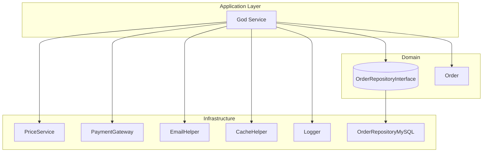
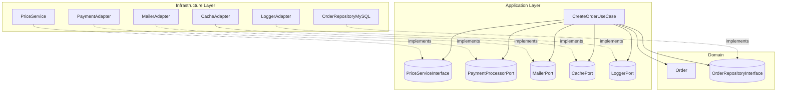

# God Service

## 概述
是一種很常見的設計方式，它將所有的業務邏輯都放在一個 Service 中，這個 Service 通常被戲稱為 `God Service`

God Service 是指把大量職責（商業規則、驗證、流程協調、跨服務整合、I/O 副作用）堆在同一個 Service 裡的反樣式（anti-pattern）。它常見於「先做再說」的迭代中，短期好寫，長期卻造成可讀性、可測性與可維護性全面惡化

## 主要問題

- 違反單一職責原則 ([SRP](#srp)): 一個類別同時負責定價、訂單狀態、通知、快取、第三方整合
- 依賴綁死 ([Tight Coupling](#tight-coupling)): 直接依賴具體技術（SDK/Helper/ORM），重構牽動巨大
- 測試脆弱 ([Overspecified Interaction](#overspecified-interaction)): 需要 mock 許多協作者；任一流程順序或參數微調，測試就集體紅燈
- 可讀性差: 方法數量爆炸、參數長串、條件分支巢狀
- 演進困難: 想新增快取、A/B、額外通知或換金流，都要改動同一塊大腦袋

## 常見徵兆
- 以下數量過多:
    - 類別行數 > 300
    - 方法數 > 10
    - 建構子注入 > 5
- 籠統的方法命名: 
    - process()
    - handle()
    - doAll()
    - sync()
    - execute()
- 控制流程橫跨 `驗證 → 寫庫 → 寄信 → 打 API → 記 log → 失敗補償`
- 相同 Service 被 `多個` Controller 共用，但每個 Controller `只用一小段`

## 範例
```php
final class OrderService
{
    public function __construct(
        private OrderRepositoryInterface $orders,
        private PriceService $prices,             // 具體類別
        private EmailHelper $emailer,             // Infra 細節
        private CacheHelper $cache,               // Infra 細節
        private PaymentGateway $paymentGateway,   // Infra 細節
        private Logger $logger                    // Infra 細節
    ) {}

    public function create(array $dto): Order
    {
        $this->logger->info('create_in', $dto);

        // 驗證 + 定價 + 建構
        $price = $this->prices->getFinalPriceTwd($dto['product_id']);
        $order = new Order($dto['product_id'], $dto['user_id'], $price);
        $saved = $this->orders->save($order);

        // 支付 + 通知 + 快取
        $this->paymentGateway->charge($saved->id(), $price);
        $this->emailer->sendOrderCreated($saved);
        $this->cache->invalidateUser($dto['user_id']);

        $this->logger->info('create_ok', ['order_id' => $saved->id()]);
        return $saved;
    }

    public function refund(int $orderId): void { /* 又一坨流程… */ }
    public function cancel(int $orderId): void { /* 又一坨流程… */ }
    public function syncWithErp(int $orderId): void { /* 又一坨流程… */ }
}
```
**問題點摘要**
- 職責混雜
- 依賴具體實作
- 測試要 mock 一堆
- 擴充困難

**關係依賴**


---

**正解思路**
- 以 `用例` 為單位切分服務：CreateOrderUseCase、RefundOrderUseCase、CancelOrderUseCase…
- 定義 `Port (介面)` 隔離副作用：PaymentProcessorPort、MailerPort、CachePort、PriceServiceInterface
- Infrastructure 實作 Adapter：外部 SDK/Helper 只存在於 Infra
- 事件或裝飾器分離橫切關注：記錄 log、發通知、快取等由事件處理器或 `Decorator` 承擔
- Domain 專注規則：Order 聚合與領域規則 (可否付款、狀態轉換)

**重構版本**

Port (Application Layer)
```php
interface PriceServiceInterface { public function getFinalPriceTwd(int $productId): float; }
interface PaymentProcessorPort { public function charge(int $orderId, float $amount): void; }
interface MailerPort { public function orderCreated(Order $order): void; }
interface CachePort { public function invalidateUser(int $userId): void; }
interface LoggerPort { public function info(string $msg, array $ctx = []): void; }

interface CreateOrderUseCase {
    public function handle(CreateOrderCommand $cmd): Order;
}
```

Use Case (Application Layer)
```php
final class CreateOrderUseCase
{
    public function __construct(
        private OrderRepositoryInterface $orders,
        private PriceServiceInterface $prices,
        private PaymentProcessorPort $payments,
        private MailerPort $mailer,
        private CachePort $cache,
        private LoggerPort $log
    ) {}

    public function handle(CreateOrderCommand $c): Order
    {
        $this->log->info('create_in', ['user' => $c->userId, 'product' => $c->productId]);

        $price = $this->prices->getFinalPriceTwd($c->productId);
        $order = Order::create($c->productId, $c->userId, $price);

        $saved = $this->orders->save($order);
        $this->payments->charge($saved->id(), $price);

        // 橫切關注
        $this->mailer->orderCreated($saved);
        $this->cache->invalidateUser($c->userId);

        $this->log->info('create_ok', ['order_id' => $saved->id()]);
        return $saved;
    }
}
```

Adapters (Infrastructure)
```php
final class MailerAdapter implements MailerPort {
    public function __construct(private EmailHelper $helper) {}
    public function orderCreated(Order $o): void { $this->helper->sendOrderCreated($o); }
}
final class PaymentAdapter implements PaymentProcessorPort {
    public function __construct(private PaymentGateway $sdk) {}
    public function charge(int $orderId, float $amount): void { $this->sdk->charge($orderId, $amount); }
}
final class CacheAdapter implements CachePort {
    public function __construct(private CacheHelper $cache) {}
    public function invalidateUser(int $userId): void { $this->cache->invalidateUser($userId); }
}
final class PriceService implements PriceServiceInterface {
    /* 具體實作，內含 API/換匯/折扣邏輯，可自由重構 */
}
```

Command (Application Layer)
```php
final class CreateOrderCommand
{
    public function __construct(
        public readonly int $productId,
        public readonly int $userId,
        public readonly ?string $couponCode = null,
        public readonly int $quantity = 1
    ) {}
}
```

Controller (Presentation Layer)
```php
final class OrderController extends Controller
{
    public function __construct(
        private CreateOrderUseCase $createOrder
    ) {}

    public function store(CreateOrderRequest $req)
    {
        $order = $this->createOrder->handle(
            new CreateOrderCommand(
                productId: (int)$req->input('product_id'),
                userId: (int)$req->user()->id
            )
        );
        return new OrderResource($order);
    }
}
```

**關係依賴**


## 備註

### SRP - Single Responsibility Principle <a id="srp"></a>

**單一職責原則**
> 一個類別（Class）應該只有一個導致它變更的原因

每個類別、模組或函式都應只負責「一件事」<br>
當同時負責太多功能（例如驗證、寄信、記錄 log、存資料庫）時<br>
任何一個需求變動都可能牽連整個類別，導致難以測試與維護<br>

**常見違反例子：**  
`OrderService` 同時處理「訂單邏輯 + 通知 + 付款 + 快取」，導致每個職責糾纏不清。

---

### Tight Coupling <a id="tight-coupling"></a>

**緊密耦合**
> 當一個模組或類別過度依賴另一個具體實作時，兩者會一起變動。

這種 `綁死` 的關係會讓系統 `失去彈性`：
- 一旦底層實作改變（例如更換 Email SDK），上層 Service 也要改
- 測試時要同時模擬整個依賴鏈，導致測試難寫、維護成本高

**解法：**  
透過 **抽象介面 (Interface)** 或 **Port/Adapter 模式**<br>
讓上層只依賴 `契約`，而非具體實作

---

### Overspecified Interaction <a id="overspecified-interaction"></a>

**過度規範化的互動**  
> 指測試過度關心物件「如何互動」，而非「做了什麼」。  

測試若太依賴內部實作細節（例如呼叫次數、順序），  
會導致在重構時非常脆弱。  
即使行為沒變，只要方法名稱或流程改動，測試就會失敗。  

**解法：**  
聚焦「結果」而非「過程」。  
例如：

```php
// ❌ 錯誤：過度規範
$mock->shouldReceive('charge')->once()->with(100);

// ✅ 正確：關注結果
$order = $useCase->handle($command);
$this->assertEquals('paid', $order->status());
