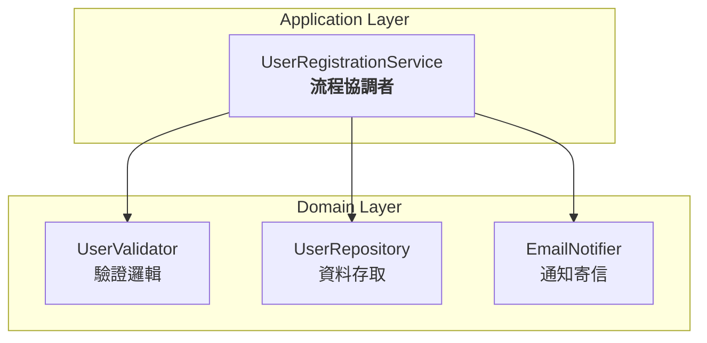

# Single Responsibility Principle

## 概論

簡單來說，就是每個元件：

* 僅需做好 `一件事`
* 應該僅有 `一種` 且 `唯一一種` 被 **修改的理由**

---

## 違反原則範例

### 程式碼

```php
class UserRegistrationService
{
    public function register(array $data): int
    {
        // 驗證邏輯
        if (empty($data['email']) || !filter_var($data['email'], FILTER_VALIDATE_EMAIL)) {
            throw new InvalidArgumentException('Invalid email');
        }

        // 資料存取邏輯
        $userId = $this->saveUser($data);

        // 寄信邏輯直接從該 Service 中呼叫
        $this->sendWelcomeEmail($data['email']);

        return $userId;
    }

    private function saveUser(array $data): int
    {
        // 省略實作...
    }

    private function sendWelcomeEmail(string $email): void
    {
        // 省略實作...
    }
}
```

### 問題

* **多重職責混雜**：同時負責「驗證」、「資料存取」、「通知寄信」
  → 任何一項改動都可能迫使 `UserRegistrationService` 跟著修改。
* **變動理由不唯一**：
  * 驗證規則調整（Email 格式、必填欄位）
  * 資料儲存策略變更（改用遠端 API、不同欄位）
  * 通知機制修改（改成訊息佇列、不同信件模板）
* **測試粒度不清**：測試 `register()` 時，必須同時測三種行為
* **維護成本高**：需求微調都可能牽連整個類別

---

## 遵守原則範例

### 程式碼

重點：先將 `職責` 分拆，讓每個類別只對一種變動負責。\
這裡暫不討論依賴抽象 [DIP](./02-DependencyInversionPrinciple.md)，純端聚 SRP

```php
// 驗證元件
class UserValidator
{
    public function validateRegistration(array $data): void
    {
        if (empty($data['email']) || !filter_var($data['email'], FILTER_VALIDATE_EMAIL)) {
            throw new InvalidArgumentException('Invalid email');
        }
        if (empty($data['name'])) {
            throw new InvalidArgumentException('Name is required');
        }
    }
}

// 資料存取元件
class UserRepository
{
    public function save(array $data): int
    {
        // 省略實作...
    }
}

// 通知元件
class EmailNotifier
{
    public function sendWelcome(string $email): void
    {
        // 省略實作...
    }
}

// Service 只負責呼叫整個流程會使用的元件方法
class UserRegistrationService
{
    public function __construct(
        private UserValidator $validator,
        private UserRepository $repo,
        private EmailNotifier $notifier
    ) {}

    public function register(array $data): int
    {
        $this->validator->validateRegistration($data);
        $userId = $this->repo->save($data);
        $this->notifier->sendWelcome($data['email']);

        return $userId;
    }
}
```

### 依賴關係

注意: 這裡的實作方式是違反 [DIP](./02-DependencyInversionPrinciple.md) 的



---

### 優點

#### 單一變動責任
- 驗證規則改動 → 只改 `UserValidator`
- 資料存取變更 → 只改 `UserRepository`
- 寄信方式調整 → 只改 `EmailNotifier`

#### 測試簡化
- 可獨立測試各元件，也可模擬不同情境組合

#### 維護容易
- 各功能模組分工明確，降低修改風險

#### 延伸性高
- 未來要加入「短訊通知」或「遠端 API 儲存」，只需獨立擴充就可
