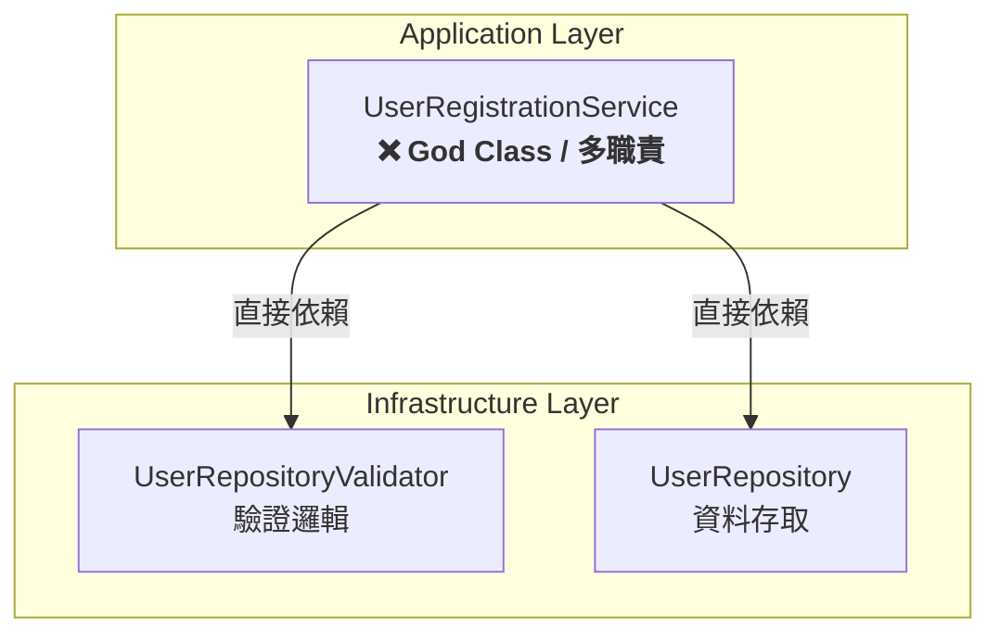
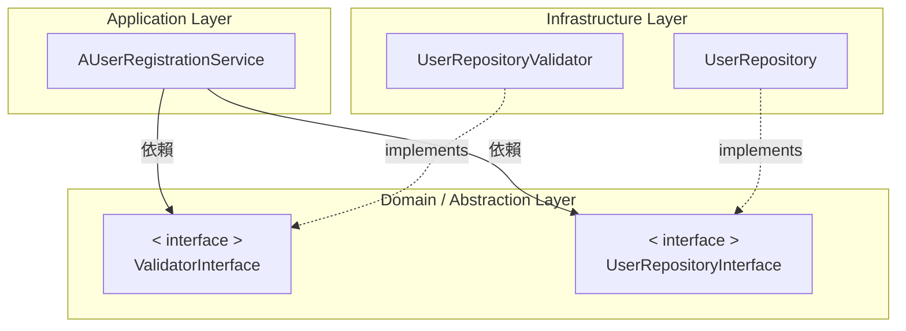

# Dependency Inversion Principle

## 概述

高層模組不應依賴低層模組，雙方都應依賴抽象，達到以下優點:
- 提升模組替換性
- 減少耦合
- 提高測試可控性

**生活例子**

想像你買了一台汽車，它只能加汽油<br>
為什麼？<br>
因為這台車的構造中，直接依賴了`吃汽油的引擎`<br>

> 這就是「高層模組依賴低層模組」的情境

但某天，一位工程師研發出了一款可以「自由更換引擎」的客車<br>
（這裡不再叫它汽車，因為它已經不綁定特定能源了）<br>

你買了這台客車後，<br>
可以像玩遊戲改裝一樣，根據需求替換不同的引擎模組：

- 要長途旅行就裝上 `汽油引擎`
- 想節能安靜就換成 `電動馬達`
- 或是參加賽事爆改一波，換上 `等離子火箭引擎` (誤)

> 這就是「高層模組不再依賴低層模組」，而是依賴抽象介面的情境

## 違反原則範例

### 程式碼
```php
<?php
class UserRepositoryValidator
{
    public function validate(array $data): void
    {
        if (empty($data['email']) || !filter_var($data['email'], FILTER_VALIDATE_EMAIL)) {
            throw new InvalidArgumentException('Invalid email');
        }
        if (empty($data['name'])) {
            throw new InvalidArgumentException('Name is required');
        }
    }
}

class UserRepository
{
    public function save(array $data): int
    {
        // 省略實作...
    }
}

class UserRegistrationService
{
    private UserRepositoryValidator $validator;
    private UserRepository $repo;

    public function __construct()
    {
        // 直接 new（強耦合）→ A 與 B/C 綁死
        $this->validator = new UserRepositoryValidator();
        $this->repo = new UserRepository();
    }

    public function register(array $data): int
    {
        // A 直接呼叫 B、C 的具體方法
        $this->validator->validate($data);
        $userId = $this->repo->save($data);

        // A 甚至還可能做更多事（例如：決定要不要發通知…）
        // -> 測試也要連動 B/C

        return $userId;
    }
}
```

### 依賴關係
Service 同時依賴 Validator 與 Repository，導致 `一變動全都要改`



### 問題
- `Service` 同時負責「業務邏輯 + 驗證 + 資料庫存取」
- 當 `Validator` 或 `Repository` 變動時，`Service` 都得修改，可參考以下情境：
    - 若 `Validator` 的方法改名 validate() → check()，`Service` 必須跟著改
    - 若 `Repository` 的 save(array $data) 改成 save(User $user)，`Service` 也要改轉換流程
    - 若 `Repository` 改為遠端 API 並需要額外參數（token、timeout 等），`Service` 的建構與呼叫點都要改
    - 由於 `Service` 自己 new `Validator`、`Repository`，無法替換實作、無法獨立測試，耦合高

**總結**：測試困難、耦合高、難以維護

## 遵守原則範例

### 程式碼

```php
// interface
interface ValidatorInterface { 
    public function validate(array $data): void; 
}
interface UserRepositoryInterface { 
    public function save(array $data): int; 
}

// 完成實作
class UserRepositoryValidator implements Validator { /* 同上 */ }
class UserRepository implements UserRepository { /* 同上 */ }

class AUserRegistrationService
{
    // 使用抽象介面
    public function __construct(
        private ValidatorInterface $validator,
        private UserRepositoryInterface $repo
    ) {}

    public function register(array $data): int
    {
        $this->validator->validate($data);
        return $this->repo->save($data);
    }
}
```

### 依賴關係



### 優點
- `Service` 不再直接依賴具體 `Validator`、`Repository`
- `Validator`、`Repository` 內部怎麼變，或要不要換別的實作，`Service` 幾乎不用改
