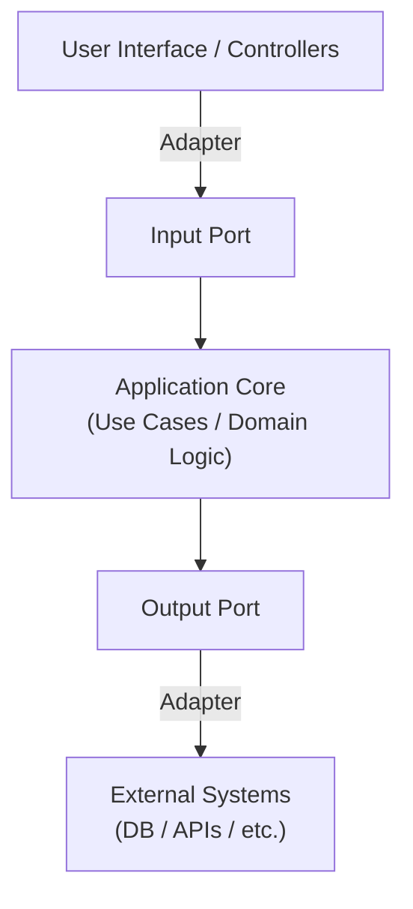
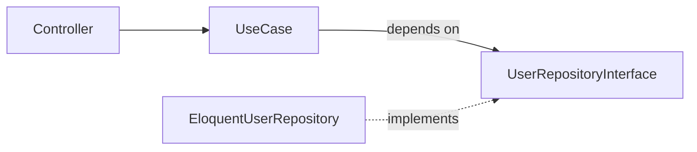

# Hexagonal Architecture

## 概述

又稱 Ports and Adapters 架構，主要目標是讓應用程式的核心邏輯與外部世界 (例如: 資料庫、UI、API、第三方服務) 解耦

### 概念圖


`Hexagon` 這個比喻不是指真的 `六邊形`，而是象徵：<br>
> 任何邊都可以是輸入或輸出介面，每一個邊代表一種外部互動方式 (port)

### 結構

注意: 這裡的結構與 [Layered Architecture](../chapter-01-LayeredArchitecture/01-LayeredArchitecture.md) 不同

| 元素 | 說明 | 例子 (Laravel 為例) |
| --- | --- | --- |
| **Application Core** | 應用程式核心，包含業務邏輯與規則，**不依賴框架或資料庫**。 | `UseCase`、`Service`、`Entity`              |
| **Port**<br>(介面)  | 對外提供/需要的抽象介面，用來隔離核心與外部。 | `UserRepositoryInterface`、`SendEmailPort` |
| **Adapter**<br>(實作) | 實際連接外部世界的程式碼，實作 Port 的細節。 | `EloquentUserRepository`、`MailgunAdapter` |
| **Primary Adapter**<br>(輸入端) | 系統被呼叫的入口，例如 Controller、CLI。     | `UserController` |
| **Secondary Adapter**<br>(輸出端) | 系統主動呼叫外部服務，例如資料庫、API、Email。     | `UserRepository`、`MailService` |


## 核心思維

> 依賴永遠指向內部 (核心)

也就是說:
- Controller (外層) 依賴 Use Case (內層)
- Use Case 依賴 Port (抽象介面)
- Adapter (具體實作) 實作 Port，而不是反過來

示意圖:


## 與傳統分層架構 Layered Architecture 的差異
| 比較項目 | 傳統三層架構 | 六角形架構 |
| ------ | ---------- | --------- |
| 依賴方向 | 通常由上往下 (Controller → Service → Repository) | 所有外部依賴都指向核心 |
| 可測性 | 測試需要資料庫或框架支援 | 可用假物件 (mock) 完全測試核心邏輯 |
| 可替換性 | 替換資料庫或框架需要大量修改 | 僅需替換 Adapter，不動核心 |
| 架構中心 | 資料流向 | 業務邏輯 (Use Case) |

## 簡易範例
```php
// Port
interface UserRepositoryInterface {
    public function save(User $user): void;
}

// Application Core
class RegisterUserUseCase {
    public function __construct(
        private UserRepositoryInterface $repo
    ) {}

    public function execute(RegisterUserRequest $request): void {
        $user = new User($request->email);
        $this->repo->save($user);
    }
}

// Secondary Adapter
class EloquentUserRepository implements UserRepositoryInterface {
    public function save(User $user): void {
        UserModel::create(['email' => $user->email]);
    }
}

// Primary Adapter
class UserController extends Controller {
    public function register(
        Request $request,
        RegisterUserUseCase $useCase
    ) {
        $useCase->execute(new RegisterUserRequest($request->email));
    }
}
```

## 優點
- 高可測試性 (可 mock 出資料庫、API)
- 易於維護與擴充
- 隔離框架與業務邏輯
- 核心邏輯可重複使用 (如 CLI、API、Events 都可共用)

## 常見應用
- Laravel + DDD 專案
- 需要支援多種外部介面的系統 (REST API、CLI、Queue)
- 希望業務邏輯可獨立於框架運行 (如轉移到其他框架時)

## 最大的問題: 為什麼要學這個

以目前工作最常遇到的情境<br>
(以下表格是 GPT 依據我平常工作餵的資料產出...汗顏)

| 問題情境| 六角形架構能帶來的幫助 |
| ------- | ----------------- |
| 在 `Service` 裡面常常看到資料驗證、商業邏輯、Eloquent 查詢全部混在一起 | 把「商業邏輯」抽出成 UseCase，`Service` 不再像 God Class |
| 想改成用 `MongoDB` 或 `ElasticSearch` 取代部分查詢 | 只要替換 `Adapter`，核心 `UseCase` 不動 |
| 想寫測試卻被 Eloquent、Redis、API 卡住 | Port 介面讓你用 Mock 物件替代外部依賴，單元測試變得超快 |
| `Controller` 跟業務邏輯糾纏在一起 | Controller 只負責「輸入轉換」→ 呼叫 UseCase →「輸出轉換」 |

### 對於專案的價值
- 掌控系統的邊界: 清楚哪些地方是 `核心`，哪些只是 `外部依賴`
- 降低技術債累積速度: 每次需求變動不再牽一髮動全身
- 提高測試與部署效率: 單元測試不再需要啟 Docker/DB
- 可長期維護: 半年後回來看仍能理解邏輯，不被框架藏起來的魔法困擾